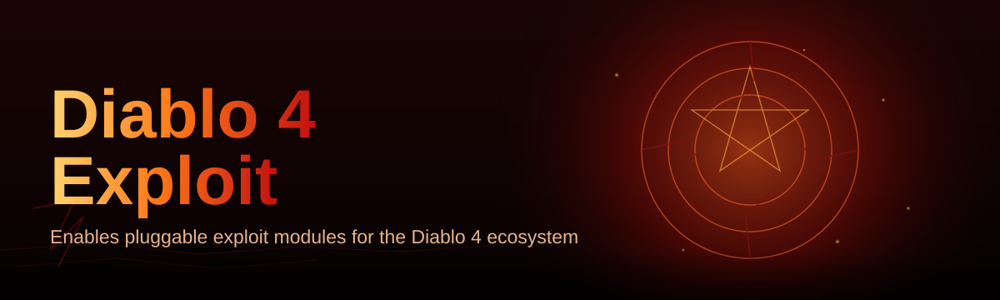

# diablo-4-config-editor 🔥🛠️

  

*A weekend obsession that turned into the config editor Sanctuary didn't know it needed.*

  

> **TL;DR**
> - A standalone Windows utility for reading, tweaking, and rebalancing your Diablo 4 local config and profile files.
> - Built solo, nights-and-weekends, because I got tired of digging through raw text files with Notepad.
> - Zero dependencies, zero installers — download, unzip, run, and start tuning.

---

## 🎮 Overview

Let's be honest: Diablo 4's settings menus are great for casuals, but the moment you want granular control over your client behavior, UI scaling quirks, or profile-level parameters, the in-game menu just shrugs at you. `diablo-4-config-editor` was born out of that exact frustration — a solo passion project that started as a Saturday afternoon "let me just parse this config file real quick" and spiraled into a full GUI application with syntax validation, live previews, and a diffing engine I'm honestly a little too proud of.

This isn't a corporate tool built by a team of ten with a roadmap and a Jira board. It's one indie developer who loves Diablo 4's systems-design so much that they wanted to poke at the edges of it responsibly, understand how the config layer is structured, and give the community a friendlier window into it. If you're a theorycrafter, a tinkerer, a streamer who wants a cleaner overlay setup, or just someone who's curious how these files are actually laid out under the hood — this is for you.

The domain of Diablo 4 configuration editing has grown a lot heading into 2026, with more players wanting reproducible, shareable configuration profiles instead of "trust me bro" settings screenshots. This project leans into that: every edit is versioned, every profile is exportable, and nothing touches your game files without an explicit backup step first.

---

## ⚔️ What This Little Tool Actually Does

  

- **Visual config mapping** — every key in your local Diablo 4 configuration is rendered as a labeled, searchable field instead of raw plaintext soup.
- **Profile snapshots** — save the exact state of your settings before you touch anything, and roll back with one click if something feels off.
- **Side-by-side diffing** — compare two profiles (yours vs. a friend's exported setup, or before/after a patch) and see precisely what changed.
- **Batch parameter tuning** — adjust a whole cluster of related values at once instead of hunting through menus one toggle at a time.
- **Validation guardrails** — the editor flags out-of-range or malformed values before you save, so you don't end up with a config the client refuses to load.
- **Export & share profiles** — package your tuned setup into a single portable file you can hand to a teammate or post in your Discord.
- **Dark and light UI themes** — because nobody wants a blinding white window open at 2am during a Helltide run.
- **Change history log** — a lightweight timeline of every edit session, so "wait, what did I even change last night" is a solved problem.

> [!TIP]
> Start every session by creating a snapshot. It takes two seconds and it's the difference between "fun experimentation" and "please send help."

---

## 🚀 Getting Up and Running

<strong>Click to expand the full onboarding flow</strong>

1. **Visit the landing page** — hit the download button above or below, it takes you straight to the project's GitHub Pages site.
2. **Grab the latest build** — the page always points to the current release, no digging through old tags required.
3. **Unzip and launch** — there's no installer wizard, no background service, just a single executable you run directly.
4. **Point it at your config folder** — the app will prompt you on first launch, or you can set the path manually in Settings.

> [!NOTE]
> First launch takes a moment longer while the app builds its local field-mapping cache. Subsequent launches are near-instant.

---

## 🖥️ System Requirements

| Component | Minimum | Recommended |
|---|---|---|
| **OS** | Windows 10 (64-bit) | Windows 11 (64-bit) |
| **RAM** | 2 GB free | 4 GB free |
| **Disk** | 150 MB available | 500 MB (for snapshot history) |

> [!IMPORTANT]
> No .NET runtime installs, no third-party frameworks, no background telemetry service. It's a self-contained executable — that was a non-negotiable design goal from day one.

---

## 🧠 Under the Hood

The architecture is intentionally simple — I wanted something I could maintain solo without losing my mind, and something the community could actually audit if they wanted to.

1. The app locates your local Diablo 4 configuration files on disk.
2. It parses them into a structured, typed model instead of raw text.
3. You edit fields through the GUI — every change is validated live.
4. On save, a backup snapshot is written before the original file is touched.
5. The updated config is written back in the exact format the client expects.

> [!WARNING]
> Always keep at least one snapshot before making sweeping edits. Config files that don't match the expected schema may cause the client to reset settings to defaults on next launch.

---

## 🩹 Troubleshooting & Common Snags

**Q: The app says it can't find my config folder — what gives?**
A: Diablo 4 sometimes installs to a non-default drive letter. Use the manual path picker in Settings and point it directly at your user profile's game data folder.

**Q: I edited a value and the game won't launch anymore.**
A: Restore your most recent snapshot from the History panel. This is exactly why the snapshot step exists — nothing is permanent until you've confirmed it works.

**Q: Does this modify an